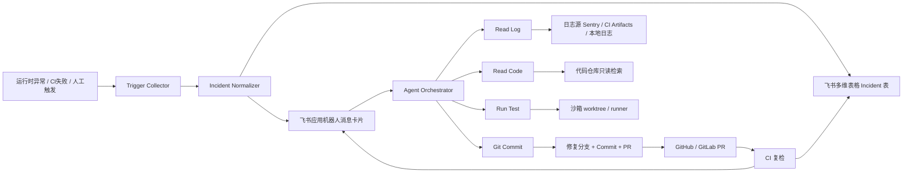
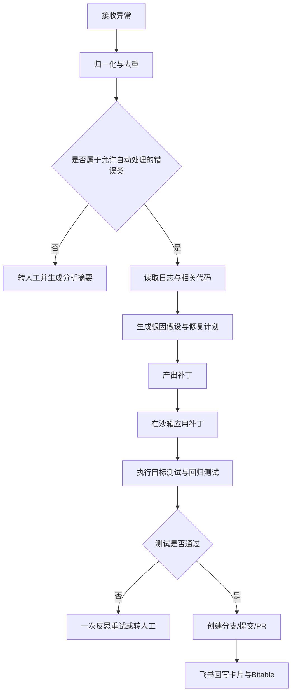

# 飞书比赛方案研究报告：基于 Agent 的服务自动化修复系统

## 执行摘要

这道题如果按“两周、三天一版、小而美、可落地”的约束来做，最优解不是追求一个“通用 Devin 式全自动修复平台”，而是做一个**强约束、单场景、可闭环演示**的服务修复 Agent：它只处理**单仓库、单服务、单语言**的已知错误类型，围绕“**Traceback/失败测试 → 根因分析 → 生成补丁 → 沙箱验证 → 创建 PR → 飞书卡片通知与人工确认**”跑通完整链路。这个方向之所以成立，是因为飞书现有能力已经覆盖了消息、卡片、回调、多维表格、知识库、工作流与权限审计；同时开放平台也提供了消息卡片更新、事件/回调订阅、长连接接收、审批与多维表格 API，足以支撑一个不依赖额外前端的闭环修复系统。citeturn3view7turn11search1turn11search4turn2search1turn4search3turn35search0turn35search1

从架构上看，最稳妥的 MVP 选型是：**运行时异常由 Sentry 或 CI 失败日志触发，飞书应用机器人发送交互卡片与写入多维表格，Agent 只暴露四个最小工具——Read Log、Read Code、Run Test、Git Commit——并且仅在沙箱 worktree 中修改代码，测试通过后只创建分支和 PR，不自动合并**。这条线的亮点在于：第一，它把“修复动作”收敛在飞书内完成协作与审阅；第二，它把“Agent 自治权”缩到可控边界内；第三，它可以在比赛周期内做出**稳定、可重复、能解释**的演示。citeturn19search3turn25search0turn44search0turn44search8turn26search1turn27search0

在飞书集成侧，**不建议把 MVP 建在群自定义机器人上**。自定义机器人虽然配置轻、无需管理员审核，但官方文档明确说明它主要用于群消息推送，不能响应用户 @ 机器人的消息，也不能获得用户与租户信息；同时，卡片请求回调只适用于应用发送的卡片，若卡片绑定自定义机器人发送，则不支持请求回调交互。对这个题目来说，你真正需要的是**应用机器人 + 消息卡片 + 卡片回调 + 长连接/回调订阅**，而不是纯 webhook 推送。citeturn1search6turn0search12turn4search3turn14search8

在模型侧，比赛路线建议采用“双轨制”：**主路线用云模型快速拿效果，备路线用开源模型保底可控**。官方文档显示，entity\["company","OpenAI","ai company"] 的 Responses API 已支持函数调用与工具调用，代码生成指南建议优先从 GPT-5 系列开始做 API 侧 coding agent；开源侧则可以采用 Qwen3 / Qwen2.5-Coder 配合 vLLM 的 OpenAI-compatible server；若只是本地单机开发与录屏演示，还可以用 entity\["company","Ollama","local llm runtime"] 作为低门槛替代，但其 OpenAI Responses 兼容目前只支持非 stateful 形态。citeturn17search4turn17search0turn17search5turn17search16turn23search0turn23search1turn23search6turn23search15

本报告的最终建议是：**初赛版本聚焦 Python 服务异常自动修复**，只支持两类入口——`Sentry 新 issue` 与 `GitHub Actions 测试失败`。输出只做三件事：**飞书卡片给出根因摘要、Agent 在沙箱内生成补丁并跑测试、验证通过后自动创建 PR 并回写飞书多维表格与卡片**。所有高风险动作都保留人工确认门，所有工具调用都落审计记录。这种做法既足够“Agent”，又真正“可落地”。citeturn25search3turn25search5turn44search0turn44search15turn10search2turn10search6

## 调研综述与项目边界

你要求优先覆盖 `feishu.cn`、`open.feishu.cn` 与 `www.feishu.cn`。从调研结果看，这三个站点在本题里分别承担**运营/权限说明、开发接口能力、产品能力与场景论证**三种角色，彼此互补，而不是重复。飞书官网页面还将飞书表述为 entity\["company","ByteDance","internet company"] 旗下的 AI 工作平台。citeturn3view7turn8search2turn30search5

| 站点               | 本次调研覆盖重点                                      | 与题目的直接关系                                        | 来源                                                                                                                                              |
| ---------------- | --------------------------------------------- | ----------------------------------------------- | ----------------------------------------------------------------------------------------------------------------------------------------------- |
| `feishu.cn`      | 帮助中心里的多维表格权限、成员行为审计、权限审计、安全与合规说明              | 用来设计权限边界、审计链路、Bitable 的行列权限与管理员侧验收口径            | citeturn10search2turn10search6turn10search15turn10search16turn10search17                                                                 |
| `open.feishu.cn` | 消息、消息卡片、卡片回调、事件订阅/长连接、多维表格、审批、CLI、OpenAPI MCP | 用来确定消息通知、交互卡片、Agent 工具接入、事件回调、Bitable 工单化与可选审批流 | citeturn2search1turn2search0turn4search3turn35search0turn35search1turn13search0turn39search0turn42search1turn30search0turn30search7 |
| `www.feishu.cn`  | 多维表格产品页、知识库产品页、安全页、工作流能力文章                    | 用来证明“飞书内闭环”是产品能力所支持的，而不是临时拼装                    | citeturn11search1turn11search4turn11search3turn3view7                                                                                     |

在这个前提下，我建议把本项目目标定义为：

**目标定义**\
做一个面向单服务研发场景的“飞书内闭环修复 Agent”，将服务异常从“被动报警”改造成“可执行修复工单”。系统在拿到 traceback 或失败测试后，自动完成最小上下文收集、错误归类、补丁生成、测试验证、PR 创建，并把过程通过飞书卡片与多维表格透明化；默认保留人工审批，不追求初赛阶段的自动上线与自动回滚。

**为什么必须缩边界**\
两周周期并不支持你做一个覆盖多语言、多仓库、多环境、多种异常源的全能系统。真正能赢的是：**少量错误类型、强验收、全过程可见**。理论上 ReAct 证明了“推理 + 动作”交错式工具使用的有效性，而 SWE-bench 则说明“仓库级代码修复”是可被系统化评价的；但这并不等于比赛里要做一个大而全的软件工程代理。更合适的策略，是把这些研究思路压缩成**单仓库受限代理**。citeturn22search0turn21search2turn21search3

**建议的 MVP 范围**\
MVP 只覆盖以下边界：单仓库、单服务、单语言（优先 Python）、单修复分支、两类触发源（Sentry runtime exception / GitHub Actions fail）、一类协作入口（飞书卡片）、一类结构化记录（飞书多维表格）。**不做**自动合并、数据库写入修复、跨服务根因分析、自动发布、自动回滚、自动修改验收测试。后两项尤其应谨慎，最新研究已经专门指出了软件工程代理中的 test overfitting 风险。citeturn21search1

## 需求定义与 MVP 验收

这个题目的需求拆解，最好按“**核心需求**”与“**次要需求**”分层，否则很容易在两周内被需求膨胀拖垮。核心需求只保留与演示闭环直接相关的部分；次要需求只做留口，不进初赛主链路。

| 层级 | 需求                         | 最低可验收结果                                                                             |
| -- | -------------------------- | ----------------------------------------------------------------------------------- |
| 核心 | 接收一条可解析的 traceback 或失败测试信息 | 能从 Sentry issue、CI 控制台日志或人工贴入文本中拿到错误栈、错误类型、文件名、行号/测试名                               |
| 核心 | 自动生成飞书告警卡片                 | 60 秒内把异常摘要、服务名、环境、优先级、按钮操作发送到群或单聊                                                   |
| 核心 | 写入飞书多维表格形成事件记录             | 至少记录 incident\_id、fingerprint、service、error\_type、status、owner、pr\_url、test\_result |
| 核心 | Agent 具备最小四工具能力            | Read Log、Read Code、Run Test、Git Commit 四个工具被调用并有审计记录                                |
| 核心 | 生成可应用的补丁                   | 模型输出 unified diff 或结构化 patch plan，且能在沙箱里通过 `git apply --check` 或等价校验                |
| 核心 | 沙箱验证                       | 至少能执行目标测试、回归测试子集，并输出 pass/fail、耗时、失败摘要                                              |
| 核心 | 自动创建 PR                    | 如果补丁验证通过，能创建修复分支、提交 commit、推送并自动创建 PR                                               |
| 核心 | 飞书内人工确认                    | 卡片里能看到“建议修复”“执行测试”“创建 PR”“转人工”几类操作与状态回写                                             |
| 次要 | 使用知识库自动沉淀 RCA              | 自动把复盘摘要写入知识库模板页或文档                                                                  |
| 次要 | 使用审批 API 做正式审签             | 用审批实例代替卡片按钮，形成更强的制度化流转                                                              |
| 次要 | 多语言支持                      | 在 Python 验证稳定后，再扩展 Node.js / Java                                                   |
| 次要 | 自动回滚                       | 初赛不建议做成自动化动作，可保留为半自动 revert PR                                                      |

对评委最有说服力的“最小功能清单”其实只有七项：**接错、记错、分析、改码、跑测、建 PR、飞书内可见**。如果你能把这七项稳定跑通，已经满足“创新、可行、可落地”的要求。相反，如果去追求大而全，很容易最后只能演示一堆概念，而没有能落地的单条主路径。

## Agent 能力规格与系统架构

在 Agent 设计上，我建议采用**有限状态机 + 工具调用**，而不是完全自由对话式代理。ReAct 与 Reflexion 的价值不在于“让模型自由发挥”，而在于把“观察—推理—行动—反馈”组织成可迭代的闭环。因此本题里最合理的 Agent，不是一个能做任何事的助手，而是一个只允许在固定边界内行动的“修复执行器”。citeturn22search0turn21search3

**最小工具规格**

| 工具         | 输入                                      | 输出                           | 权限边界                        | 失败处理                   |
| ---------- | --------------------------------------- | ---------------------------- | --------------------------- | ---------------------- |
| Read Log   | incident\_id / issue\_id / artifact\_id | 结构化错误摘要、原始 traceback、上下文日志片段 | 只读日志与工单系统，不读生产密钥            | 日志不足时要求人工补充或转人工        |
| Read Code  | repo、commit、file hints、symbol           | 相关文件片段、调用链、测试文件、配置文件摘要       | 只读仓库，不允许写入                  | 找不到上下文时只输出分析，不生成补丁     |
| Run Test   | patch、test plan                         | 测试结果、失败摘要、JUnit XML、控制台片段    | 只能在沙箱 worktree / runner 中执行 | 超时、环境错配、flake 时停止自动提交  |
| Git Commit | validated patch、branch name、commit msg  | 分支、commit hash、PR URL        | 只允许新分支写入，不允许直推主干            | 推送失败或 PR 创建失败则回写飞书并转人工 |

**Traceback 获取路径**

| 来源          | 采集方式                                                                                                             | 适用性               | 建议优先级 | 来源                                                                |
| ----------- | ---------------------------------------------------------------------------------------------------------------- | ----------------- | ----- | ----------------------------------------------------------------- |
| 运行时异常       | 应用接入 entity\["company","Sentry","error monitoring"] SDK；SDK 自动上报错误、未捕获异常与未处理拒绝；再通过 issue alert webhook 触发修复流程 | 最适合线上 runtime bug | 高     | citeturn19search7turn19search11turn25search0turn25search3   |
| Python 原生日志 | 用 `traceback` 模块提取栈，`logging` 记录异常                                                                               | 最易本地 demo         | 高     | citeturn24search0turn24search1                                |
| CI 失败       | 通过 GitHub Actions 产物与 job logs 读取失败测试输出；可用 artifact 保存测试日志、XML 报告                                                | 最适合可复现测试失败        | 高     | citeturn44search0turn44search15turn17search10turn24search10 |
| 人工补录        | 飞书卡片按钮 + 表单/粘贴附件                                                                                                 | 兜底方案              | 中     | —                                                                 |

**触发条件建议**\
触发不要太泛。MVP 只保留三类：第一，Sentry 新 issue 且达到阈值；第二，主干/发布分支上的 GitHub Actions 测试失败；第三，飞书卡片中的“人工触发分析”。这样你既能覆盖线上问题，也能覆盖“提交导致回归”的开发场景。citeturn25search12turn44search1

**飞书回调与交互约束**\
卡片交互请求要求服务端在 3 秒内返回 HTTP 200；如果分析与测试时间更长，应采用“先 ACK，再异步执行，再用更新卡片或延时更新卡片接口回写结果”的策略。官方文档还明确写了：批量发送的卡片不支持更新与回传交互，因此审批/修复卡片绝不能用批量发消息实现。citeturn36search2turn36search3turn7search0turn7search6turn36search7

下面是推荐的数据流架构：



这张图的关键点在于：**飞书既不是单纯通知端，也不是业务后端本身，而是“人、工单、状态、审阅动作”的协作壳层**；真正执行代码修复的部分仍然发生在仓库沙箱与 CI 中。这个角色分配与飞书的消息、Bitable、知识库、权限与回调能力是吻合的。citeturn2search1turn13search0turn39search0turn11search4turn10search17

下面是建议的 Agent 决策循环：



组件职责建议如下：

| 组件                  | 职责                           |
| ------------------- | ---------------------------- |
| Trigger Collector   | 接收来自 Sentry、CI 或飞书按钮的触发信号    |
| Incident Normalizer | 做 fingerprint、去重、优先级映射、字段规范化 |
| Feishu App Adapter  | 发送卡片、处理按钮回调、写 Bitable、可选发起审批 |
| Agent Orchestrator  | 控制状态机，决定下一步工具调用              |
| Sandbox Executor    | 建立 worktree、执行 patch 应用与测试   |
| Repo Gateway        | 负责分支、commit、push、PR 创建       |
| Audit Logger        | 记录每次工具调用、模型输入输出摘要、人工动作       |

## 技术栈与飞书接口选型

从工程性与比赛周期平衡来看，我建议主栈采用 **Python 3.11 + FastAPI + Pydantic + 原生 Git CLI + GitHub Actions + 飞书开放平台 HTTP API/SDK**。理由是：Python 在 traceback、沙箱执行、文件处理、测试编排上最省时间；FastAPI 做 webhook 与回调足够轻；Pydantic 便于约束输入输出；`git worktree` 非常适合隔离修复分支；GitHub Actions 与 PR API 可以把验证链路与评审链路打通。citeturn26search1turn44search0turn44search8

在工具与平台接入上，我建议你优先考虑以下几类组织/平台：entity\["company","GitHub","developer platform"] 作为首选代码托管与 PR 目标；若团队仓库已经在 entity\["company","GitLab","devops platform"]，则直接沿用其 CI/CD 与 MR API；监控侧首选 entity\["company","Sentry","error monitoring"]，自建日志后端备选 entity\["company","Grafana Labs","observability company"] 的 Loki；若企业已有 entity\["organization","Jenkins","automation server"] 基建，也可以把测试执行器挂到既有流水线上。citeturn19search0turn19search1turn19search2turn19search3turn20search5

### 飞书 API 与 CLI 选型表

| 类型        | 名称 / 端点 / 命令                                                                                          | MVP 用途                   | 关键说明                                                                  | 来源                                                                                         |
| --------- | ----------------------------------------------------------------------------------------------------- | ------------------------ | --------------------------------------------------------------------- | ------------------------------------------------------------------------------------------ |
| API       | `POST /open-apis/auth/v3/tenant_access_token/internal`                                                | 获取 `tenant_access_token` | 自建应用常用，摘要显示有效期为 2 小时                                                  | citeturn4search0                                                                        |
| API       | `POST /open-apis/auth/v3/app_access_token/internal`                                                   | 获取 `app_access_token`    | 备选访问凭证，摘要显示最长 2 小时                                                    | citeturn4search4                                                                        |
| API       | `POST /open-apis/im/v1/messages`                                                                      | 发送告警卡片 / 结果通知            | 发送消息前提是应用需要开启机器人能力                                                    | citeturn2search1turn28search8                                                          |
| API       | `PATCH /open-apis/im/v1/messages/:message_id`                                                         | 更新已发送的状态卡片               | 适合把“分析中/测试中/已建 PR”回写到同一张卡片                                            | citeturn7search3turn2search0                                                           |
| API       | `POST /open-apis/interactive/v1/card/update`                                                          | 延时更新卡片                   | 官方摘要注明可在 30 分钟内延时更新，适合异步分析                                            | citeturn7search0turn7search6                                                           |
| 回调        | `card.action.trigger`                                                                                 | 接收卡片按钮点击                 | 建议使用新版卡片回调；卡片交互需在 3 秒内响应；绑定自定义机器人发送的卡片不支持请求回调交互                       | citeturn6search8turn36search2turn36search3turn4search3                               |
| API       | `POST /open-apis/bitable/v1/apps/:app_token/tables/:table_id/records`                                 | 新增 Incident 记录           | 用于工单化、状态追踪与演示看板                                                       | citeturn13search0                                                                       |
| API       | `POST /open-apis/bitable/v1/apps/:app_token/tables/:table_id/records/search`                          | 按 fingerprint 检索/去重      | 便于避免重复修复同一问题                                                          | citeturn39search0                                                                       |
| API       | `PUT /open-apis/bitable/v1/apps/:app_token/tables/:table_id/records/:record_id`                       | 更新状态、测试结果、PR 链接          | 摘要明确为 PUT 更新                                                          | citeturn40search0                                                                       |
| API       | `POST /open-apis/approval/v4/instances`                                                               | 可选：创建正式审批实例              | 若要做企业级审签流可用，但不建议卡主 MVP 主路径                                            | citeturn42search1turn42search3                                                         |
| 接收方式      | 长连接接收事件 / 回调                                                                                          | 本地调试与比赛开发阶段首选            | 官方文档明确：无需公网 IP 或域名，也无需内网穿透                                            | citeturn35search0turn35search1turn35search4turn35search5                             |
| 机器人       | 群自定义机器人 Webhook                                                                                       | 仅用于被动通知                  | 无需管理员审核，但不能响应 @、不能获取用户/租户信息；固定统一路径未指定，URL 由群配置页生成                     | citeturn1search6turn0search12turn14search8                                            |
| CLI       | `opdev login`                                                                                         | 登录飞书开发者工具命令行             | 适合开发者工具场景                                                             | citeturn8search0turn8search4                                                           |
| CLI       | `opdev preview`                                                                                       | 预览开发中的项目                 | 更适合插件/小程序类场景，服务器应用未必必须                                                | citeturn8search0turn8search4                                                           |
| CLI       | `opdev upload`                                                                                        | 上传代码                     | 适合飞书开发者工具工作流                                                          | citeturn8search0turn8search4                                                           |
| CLI / MCP | 本地 OpenAPI MCP 工具，如 `im.v1.message.create`、`bitable.v1.app.create`、`bitable.v1.appTableRecord.search` | 把飞书能力直接暴露给 Agent         | 官方已提供本地 OpenAPI MCP；但远程 MCP 当前仅支持云文档场景，所以消息/Bitable 更建议直接 API 或本地 MCP | citeturn30search0turn30search6turn30search7turn1search0turn13search17turn39search8 |

**接口设计结论**\
MVP 主链路请只用三类飞书能力：**应用机器人消息卡片、卡片回调、Bitable 记录**。审批 API、知识库写回、MCP 深度集成都可以作为第二阶段加分项。尤其注意两点：第一，**审批卡片不要走批量发送**；第二，**如果要做按钮交互，就不要用自定义机器人做主入口**。citeturn36search7turn4search3

### 飞书调用示例

下面的示例只保留 MVP 会用到的三段：拿 token、发卡片、写 Bitable。字段名与卡片内容建议用环境变量和模板文件管理，避免把业务常量散落在代码里。

```bash
# 获取 tenant_access_token
curl -X POST "https://open.feishu.cn/open-apis/auth/v3/tenant_access_token/internal" \
  -H "Content-Type: application/json" \
  -d '{
    "app_id": "'"$FEISHU_APP_ID"'",
    "app_secret": "'"$FEISHU_APP_SECRET"'"
  }'
```

```bash
# 向群聊发送一张交互卡片（示意）
curl -X POST "https://open.feishu.cn/open-apis/im/v1/messages?receive_id_type=chat_id" \
  -H "Authorization: Bearer $TENANT_ACCESS_TOKEN" \
  -H "Content-Type: application/json" \
  -d '{
    "receive_id": "'"$FEISHU_CHAT_ID"'",
    "msg_type": "interactive",
    "content": "{\"config\":{\"wide_screen_mode\":true},\"header\":{\"title\":{\"tag\":\"plain_text\",\"content\":\"Agent 自动修复告警\"},\"template\":\"red\"},\"elements\":[{\"tag\":\"div\",\"text\":{\"tag\":\"lark_md\",\"content\":\"**service**: order-api\\n**error**: AttributeError\\n**file**: app/service.py:87\"}},{\"tag\":\"action\",\"actions\":[{\"tag\":\"button\",\"text\":{\"tag\":\"plain_text\",\"content\":\"开始分析\"},\"type\":\"primary\",\"value\":{\"action\":\"analyze\",\"incident_id\":\"INC-20260424-001\"}},{\"tag\":\"button\",\"text\":{\"tag\":\"plain_text\",\"content\":\"转人工\"},\"value\":{\"action\":\"handoff\",\"incident_id\":\"INC-20260424-001\"}}]}]}"
  }'
```

```bash
# 写入飞书多维表格 Incident 记录
curl -X POST "https://open.feishu.cn/open-apis/bitable/v1/apps/$APP_TOKEN/tables/$TABLE_ID/records" \
  -H "Authorization: Bearer $TENANT_ACCESS_TOKEN" \
  -H "Content-Type: application/json" \
  -d '{
    "fields": {
      "IncidentID": "INC-20260424-001",
      "Service": "order-api",
      "Env": "prod",
      "ErrorType": "AttributeError",
      "Fingerprint": "order-api:AttributeError:app/service.py:87",
      "Status": "NEW"
    }
  }'
```

这些端点、权限前提与能力边界都来自飞书开放平台文档；其中“发送消息需要机器人能力”“卡片可更新”“多维表格支持新增与检索记录”是整个主链路的技术基础。citeturn4search0turn2search1turn7search3turn13search0turn39search0

### 模型接入方案比较

| 方案      | 典型选型                                                                                   | 成本                                                                                                                 | 延迟             | 可控性 | 调试便利性 | 适合阶段                | 来源                                                                            |
| ------- | -------------------------------------------------------------------------------------- | ------------------------------------------------------------------------------------------------------------------ | -------------- | --- | ----- | ------------------- | ----------------------------------------------------------------------------- |
| 云模型方案   | entity\["company","OpenAI","ai company"] Responses API + `gpt-5.4-mini` / `gpt-5.4` | 公开页按 token 计费；截至 2026-04-24，`gpt-5.4-mini` 公开价为输入 `$0.75/1M`、输出 `$4.50/1M`，`gpt-5.4` 为输入 `$2.50/1M`、输出 `$15.00/1M` | 中              | 中   | 高     | 最适合初赛，接入快、代码质量高     | citeturn17search4turn17search0turn17search5turn17search16turn18search9 |
| 自托管开源方案 | Qwen3 / Qwen2.5-Coder + vLLM OpenAI-compatible server                                  | 官方未给统一 API 价格，成本主要转化为 GPU / 云主机费用                                                                                  | 取决于硬件；局域网内通常较稳 | 高   | 高     | 适合半私有化或对日志外发敏感的团队   | citeturn23search0turn23search1turn23search6                              |
| 本地轻量方案  | entity\["company","Ollama","local llm runtime"] + Qwen 本地模型                         | 近似为本地硬件成本                                                                                                          | 小模型快，大模型慢      | 高   | 很高    | 适合单机开发、离线 demo、录屏保底 | citeturn23search3turn23search15                                           |

**推荐结论**\
如果你追求比赛成功率，建议采用“**主云副本地**”策略：默认用 OpenAI 云模型跑主流程，保留一套 Qwen + vLLM 或 Ollama 的降级路线。这样既能保证初赛效果，又能在评委问到“数据安全与可控性”时给出清晰答案。OpenAI 官方文档已经将 Responses API 定义为更适合 agentic loop 的接口，而 Qwen3 / Qwen2.5-Coder 则非常适合做中文环境下的代码修复备选。citeturn17search16turn17search20turn23search0turn23search1

### 日志、CI 与代码托管策略比较

| 类别   | 方案                        | 优点                                        | 缺点                        | 建议              |
| ---- | ------------------------- | ----------------------------------------- | ------------------------- | --------------- |
| 日志   | Sentry issue + webhook    | 直接按 issue 触发，天然按错误聚合，拿 traceback 最直接      | 依赖外部服务；需要接 SDK            | 已有 Sentry 的团队首选 |
| 日志   | OpenTelemetry Logs + Loki | 标准化强、可自建、可和 traces 关联                     | 运维复杂度高，不适合两周从零搭起          | 作为企业化备选         |
| 日志   | CI artifacts / 控制台日志      | 成本最低，接入最快，特别适合“失败测试修复”                    | 只能覆盖可复现测试失败，不覆盖真实线上异常     | 初赛必备兜底          |
| CI   | GitHub Actions            | 与 PR、Artifacts、REST API 打通最好，最适合自动建 PR 闭环 | 与 GitHub 绑定更深             | 若仓库在 GitHub，优先  |
| CI   | GitLab CI/CD              | push、MR、schedule 都能触发，MR API 完整           | 若你主协作在 GitHub，则会增加多平台心智负担 | 仓库已在 GitLab 时沿用 |
| CI   | Jenkins Pipeline          | 企业存量常见，Jenkinsfile 可复用                    | 搭建/权限/插件治理比 Actions 重     | 有现成 Jenkins 时再用 |
| 代码托管 | GitHub App + PR API       | 官方偏好 GitHub App，权限细粒度、短期 token、可独立于用户运行   | 需要多一步 App 注册与安装           | 生产方案首选          |
| 代码托管 | GitLab token + MR API     | 与 GitLab CI 一体化强                          | 细粒度与生态体验取决于现有实例配置         | GitLab 项目首选     |
| 代码托管 | 个人 PAT                    | 接入快                                       | 权限过宽、审计与轮换都更差             | 不建议进入正式版        |

上表各项取舍都能在官方文档中找到清晰依据：Sentry 支持 issue alert webhook；OpenTelemetry 旨在用统一数据模型处理现有日志；Loki 原生支持通过 OTel Collector ingest；GitHub Actions 原生支持 artifacts；GitHub App 比 OAuth App 更适合细粒度自动化；GitLab CI/CD 与 MR API、Jenkins Pipeline 也都有完整官方能力。citeturn25search0turn25search3turn20search4turn20search5turn44search0turn44search15turn34search1turn34search5turn19search0turn19search1turn19search18

## 详细预设文档

这一节给的是你可以直接落地到仓库里的“预设文档骨架”。如果做比赛，我建议把这些内容整理为 `docs/design.md`、`docs/prompt.md`、`docs/acceptance.md` 三份文档，评委问到细节时可以直接打开。

**数据流约定**

1. `IncidentIn`：触发器的标准化输入。
2. `AnalysisResult`：模型对错误的摘要与修复计划。
3. `PatchProposal`：统一 diff 或结构化修改建议。
4. `ExecutionReport`：测试与 PR 执行结果。

建议的输入输出格式如下：

```json
{
  "incident_id": "INC-20260424-001",
  "source": "sentry",
  "service": "order-api",
  "env": "prod",
  "repo": "org/order-api",
  "default_branch": "main",
  "error_type": "AttributeError",
  "traceback": "Traceback (most recent call last): ...",
  "fingerprint": "order-api:AttributeError:app/service.py:87",
  "suspected_files": ["app/service.py", "tests/test_service.py"],
  "triggered_at": "2026-04-24T10:12:30+08:00"
}
```

```json
{
  "incident_id": "INC-20260424-001",
  "classification": "deterministic_runtime_bug",
  "root_cause": "service.py 在 user=None 时访问了 user.id",
  "confidence": 0.86,
  "patch_format": "unified_diff",
  "patch": "diff --git a/app/service.py b/app/service.py\n...",
  "tests_to_run": ["pytest tests/test_service.py -q"],
  "risk_level": "medium",
  "need_human_review": true
}
```

```json
{
  "incident_id": "INC-20260424-001",
  "apply_ok": true,
  "target_tests_ok": true,
  "regression_tests_ok": true,
  "commit_sha": "abc1234",
  "branch": "fix/inc-20260424-001",
  "pr_url": "https://github.com/org/order-api/pull/123",
  "summary": "修复了 user 为空时的空引用，并新增边界测试"
}
```

**Prompt 设计示例**

下面这段 Prompt 是面向“Traceback 分析 + 生成补丁”的最小可用版本，强调“先诊断、后修补、最后验证”，并明确禁止越权动作。它符合 ReAct 式“先观察上下文，再决定行动”的思想，但用更工程化、更易控的输出契约来约束模型。citeturn22search0turn21search3

```text
你是一个受限的软件修复 Agent，只能完成以下任务：
1. 阅读 traceback、相关日志与指定代码文件；
2. 给出根因分析；
3. 生成最小补丁；
4. 提出应执行的测试命令；
5. 绝不直接假设未给出的环境信息；
6. 默认不修改测试文件，除非用户明确允许；
7. 不得修改部署脚本、密钥、数据库迁移文件；
8. 如果错误属于外部依赖、网络波动、数据脏数据或权限问题，优先输出“转人工”而不是硬修。

请严格输出 JSON：
{
  "classification": "",
  "root_cause": "",
  "patch_format": "unified_diff",
  "patch": "",
  "tests_to_run": [],
  "risk_level": "",
  "need_human_review": true,
  "why_not_fix_automatically": ""
}

输入信息：
- 服务名：{{service}}
- 代码仓库：{{repo}}
- traceback：
{{traceback}}

- 相关文件摘要：
{{related_files}}

- 已知失败测试：
{{failed_tests}}
```

**错误分类策略**

| 分类        | 典型例子                                   | 是否允许自动建 PR | 处理策略              |
| --------- | -------------------------------------- | ---------- | ----------------- |
| 确定性代码缺陷   | `AttributeError`、`KeyError`、空引用、边界条件缺失 | 是          | 允许分析、补丁、测试、PR     |
| 依赖 / 配置问题 | `ModuleNotFoundError`、环境变量缺失、版本冲突      | 谨慎         | 若能在沙箱稳定复现再修，否则转人工 |
| 外部系统问题    | 网络超时、第三方 API 500、DNS 波动                | 否          | 只输出证据与建议，不改业务代码   |
| 数据问题      | 脏数据、线上历史数据不兼容                          | 否          | 生成 RCA 与数据修复建议    |
| 安全 / 权限问题 | token 失效、密钥暴露、权限不足                     | 否          | 立即转人工并加审计标记       |
| 测试不稳定     | flaky test、时间相关测试失败                    | 否          | 标记为不稳定，不让模型追着测例乱改 |

这里最重要的一条是：**不要让模型在初赛版自动修改验收测试**。因为一旦允许模型通过改测试“修好”问题，系统会非常容易演变成“让红变绿”而不是“真正修 bug”。这在近年的软件工程代理研究里已经被反复指出是核心风险。citeturn21search1

**回滚与人工介入策略**

回滚策略建议非常保守：\
默认只自动创建 PR，不自动合并。若后续真的扩展到合并后健康检查，也应使用 `git revert` 生成回滚提交，而不是对共享分支做 `git reset --hard`。官方 Git 文档明确区分了 `revert` 与 `reset --hard`：前者是“创建一个新的反向提交”，后者会直接覆盖工作区并可能带来破坏性后果。citeturn27search1turn27search2turn27search11

人工介入点建议固定为四个：

1. 错误分类不在白名单内。
2. 模型信心低于阈值，例如 `<0.75`。
3. 目标测试没过，或回归测试出现新增失败。
4. 修改触及高风险目录，例如 `migrations/`、`infra/`、`security/`。

**测试用例与验收标准**

你应该准备一组“可控种子故障”，不要拿随机线上问题做首秀。推荐如下：

| 用例         | 触发方式                  | 期望系统行为               | 验收标准             |
| ---------- | --------------------- | -------------------- | ---------------- |
| Python 空引用 | 运行时抛 `AttributeError` | 卡片通知、生成补丁、测试通过、创建 PR | 端到端闭环完成          |
| Python 键缺失 | 运行时抛 `KeyError`       | 补充安全访问或默认值           | 目标测试与回归测试均通过     |
| CI 失败用例    | `pytest` 某测试失败        | 从 artifact 中读失败详情再修复 | 能展示只基于 CI 入口完成修复 |
| 风险目录变更     | 故障位于 `infra/`         | Agent 拒绝自动提交         | 卡片显示“需人工处理”      |
| 外部接口超时     | 模拟第三方 500             | Agent 只做归因、不改码       | 无 commit、无 PR    |
| 回调超时       | 人工点击按钮时长任务            | 先 3 秒内 ACK，再异步回写卡片   | 前端不卡死，卡片状态正确更新   |

在测试框架上，单元测试优先用 pytest；如果你的 demo 服务带前端或控制台页面，再加 Playwright 做一条最小 E2E。pytest 官方文档提供了 fixture 与 `--junit-xml` 输出，Playwright 官方文档则明确其是现代 Web 应用的测试框架，并支持在 CI 中运行。citeturn20search2turn20search14turn24search10turn20search3turn20search11turn20search15

## 安全合规与风险控制

这个项目最大的风险，不是“模型修不好”，而是“模型越权修了不该修的东西”。因此安全设计必须是主线，而不是附录。飞书帮助中心与产品页已经明确覆盖了安全、合规、成员行为审计、权限审计与多维表格高级权限能力；这些能力非常适合拿来做这类修复 Agent 的边界控制。citeturn10search2turn10search6turn10search15turn10search16turn11search3

**建议的权限与合规控制表**

| 控制点          | 建议做法                                             | 说明                                       | 来源                                                             |
| ------------ | ------------------------------------------------ | ---------------------------------------- | -------------------------------------------------------------- |
| 飞书消息权限       | 只申请发送消息所需最小权限与机器人能力                              | 发送消息前提是开启机器人能力；避免一开始申请过多通讯录权限            | citeturn2search1turn28search8                              |
| Bitable 数据权限 | 对 Incident 表启用高级权限，按角色控制行列可见范围                   | 官方帮助中心支持角色、行列级高级权限                       | citeturn10search7turn10search13turn10search17             |
| 飞书回调安全       | 配置 Encrypt Key / 签名校验；卡片回调地址强校验来源                | 官方文档明确支持对回调与事件进行安全校验                     | citeturn14search0turn14search1turn14search2turn14search5 |
| 仓库认证         | 使用 GitHub App，而非长期 PAT                           | GitHub 官方更推荐 GitHub App，因其细粒度权限与短期 token | citeturn34search1turn34search5turn34search6               |
| Secrets 管理   | 把密钥放在 Actions secrets / 环境 secrets；工作流显式引入       | GitHub Actions secrets 只有显式注入时才能被工作流读取   | citeturn33search1turn33search4                             |
| Repo 访问范围    | 只授予修复目标仓库的最小角色与最小 App 权限                         | GitHub 官方强调按最小权限与仓库粒度配置                  | citeturn33search2turn34search0turn34search5               |
| 代码提交风险       | 只允许新分支提交，禁止直推主干与自动 merge                         | 保持人工审阅门                                  | —                                                              |
| 回滚风险         | 只用 `git revert` 生成回滚 PR，不用 `reset --hard` 操作共享分支 | 避免破坏性回滚                                  | citeturn27search1turn27search2turn27search11              |
| 审计追踪         | 所有 Agent 工具调用与人工动作同步写 Bitable 与系统日志              | 飞书管理员可做成员行为审计与权限审计；系统侧再补业务审计             | citeturn10search2turn10search6                             |

**日志与 Prompt 脱敏要求**\
凡是要送进模型的 traceback、环境上下文与配置片段，都必须先过一层 redaction：屏蔽 token、cookie、Authorization header、手机号、邮箱、数据库连接串与私钥片段。原则上，**模型不需要知道 secrets 才能修多数 bug**；一旦 bug 修复依赖真实密钥，那它就不属于初赛阶段的自动修复白名单。

**关于飞书版本能力**\
如果你使用的是比赛租户或轻量租户，要提前核验管理后台里是否能用到你想演示的审计与合规模块。飞书部分帮助文档也提到某些安全与合规模块存在版本差异，因此最稳妥的做法是：**把“平台审计”作为加分项，把“应用侧 Bitable 审计日志”作为必备项**。citeturn10search1turn10search9

## 两周迭代与演示方案

虽然你说“三天迭代一版”，但两周实际上更像“**四个三天版 + 两天收口**”。我建议你每三天都交出一个**可以录屏的增量版本**，而不是做四个不可见的底层重构。

| 节奏  | 时间      | 目标               | 里程碑                                               | 交付物                                        |
| --- | ------- | ---------------- | ------------------------------------------------- | ------------------------------------------ |
| 第一版 | D1-D3   | 跑通最小闭环骨架         | 能从人工贴入 traceback 触发飞书卡片与 Bitable 记录               | Feishu 应用、卡片模板、Incident 表、最小后端             |
| 第二版 | D4-D6   | 接入真实触发源          | 能从 Sentry issue 或 GitHub Actions 失败日志自动建 incident | 触发器、日志归一化、去重                               |
| 第三版 | D7-D9   | 跑通 Agent 四工具最小链路 | 能读取代码、生成 diff、在 worktree 跑 pytest                 | Agent Orchestrator、Patch Apply、Sandbox Run |
| 第四版 | D10-D12 | 跑通自动 PR + 飞书回写   | 测试通过后自动推分支并建 PR，卡片状态回写                            | Repo Gateway、PR 集成、状态回写                    |
| 收口版 | D13-D14 | 稳定性、演示、文档        | 完成种子故障脚本、风险兜底、录屏与答辩材料                             | 演示仓库、视频、答辩页、故障样本                           |

这套排期的关键不是“功能多”，而是“**每一版都能向评委展示一个新闭环**”。例如第二版只要能在群里看到“线上报错自动建卡片工单”，就已经是一个完整的小故事；第三版再叠加“模型给出修复建议并跑测”；第四版再叠加“自动 PR”。这样就算最后两天只够做稳定性，你也不会没有可讲的成果。

**演示脚本建议**

| 时间点         | 画面                           | 解说重点                                                   |
| ----------- | ---------------------------- | ------------------------------------------------------ |
| 00:00-00:30 | 展示故障服务与预埋 bug                | 强调这是一个真实可复现的服务异常，不是伪造聊天                                |
| 00:30-01:10 | 触发一个运行时错误或 CI 失败             | 说明错误由 Sentry / Actions 捕获                              |
| 01:10-01:40 | 飞书群收到红色告警卡片                  | 展示摘要、优先级、incident\_id、按钮                               |
| 01:40-02:20 | 点击“开始分析”                     | 说明 3 秒 ACK，后台异步运行 Agent                                |
| 02:20-03:00 | 卡片更新为“根因分析完成”                | 展示根因摘要、涉及文件、风险等级                                       |
| 03:00-03:50 | 进入多维表格                       | 展示 incident 记录、状态流转、审计字段                               |
| 03:50-04:30 | 展示 Agent 在 worktree 中生成补丁并跑测 | 强调 Read Log / Read Code / Run Test / Git Commit 的四工具边界 |
| 04:30-05:10 | 自动创建 PR                      | 展示分支、commit、PR 页面与 CI 结果                               |
| 05:10-05:40 | 飞书卡片更新为“PR 已创建，待审阅”          | 强调不是盲目自动合并，而是带人工门的修复                                   |
| 05:40-06:00 | 总结                           | 点出“飞书内闭环”“受限自治”“可审计”三点                                 |

**视频录制要点**

第一，务必用**一个种子故障**，不要临场制造未知 bug。\
第二，卡片文案要简洁，尽量让评委一眼看懂状态流转。\
第三，PR 名称、commit message、Bitable 字段名都要统一规范，例如统一用 `INC-编号`。\
第四，别在视频里展示太多终端噪音，关键是把“飞书卡片—Bitable—PR”三屏关系讲清楚。\
第五，准备一个失败兜底：如果模型修复失败，也要演示它如何**自动转人工并保留上下文**。这会显得系统更成熟。

## 风险评估与替代方案

最终要赢，不是因为你把所有技术都堆上去了，而是因为你知道**哪些地方必须收、哪些地方可以放**。下面是我认为最重要的风险与替代策略。

| 风险           | 表现                                  | 影响       | 缓解措施                                  | 替代方案                           |
| ------------ | ----------------------------------- | -------- | ------------------------------------- | ------------------------------ |
| 误把自定义机器人当主入口 | 卡片能发但不能做交互闭环                        | 主路径断裂    | 主入口必须用应用机器人；自定义机器人只做被动通知              | 如果时间不够，先做“被动卡片 + 人工修复建议”版本     |
| 卡片回调超时       | 点击按钮后前端报请求错误                        | 体验差、流程中断 | 3 秒内 ACK；耗时任务异步处理；用更新卡片/延时更新回写        | 失败时退化为“新发一张结果卡片”               |
| 模型乱改代码       | 改到非故障区域、测试目录、基础设施目录                 | 风险高      | 只允许白名单目录与错误类型；禁止改测试；低置信度转人工           | 缩到只输出 patch 建议，不自动提交           |
| 日志不完整        | traceback 缺文件名/上下文                  | 分析失败     | 同时读取 CI artifacts、Sentry 事件详情、相关代码    | 卡片支持人工补充日志后再分析                 |
| 测试过慢或环境难配    | Agent 即使有 patch 也无法验证               | 自动化价值被削弱 | 先只跑目标测试 + 回归子集；使用缓存环境与 worktree       | 初赛只做单元测试，不做全量 E2E              |
| 远程 MCP 能力不够  | 想直接让 Agent 远程调用飞书消息/Bitable，但当前覆盖不足 | 集成受阻     | 消息/Bitable 主路径用直接 OpenAPI；MCP 只作为加分实验 | 使用本地 OpenAPI MCP 或完全绕开 MCP     |
| 权限/版本不满足     | 审计或高级权限无法使用                         | 答辩受影响    | 把平台级能力作为加分项，不绑死主链路                    | 所有审计先落在 Bitable 与仓库评论中         |
| 成本或网络不稳定     | 云模型延迟高、不可用                          | 演示翻车     | 保留本地 Qwen/Ollama 兜底；提前缓存依赖            | 如果云模型失效，退化成“分析建议 + 人工确认 patch” |
| 评委质疑“创新性不足”  | 被看成简单 webhook 拼装                    | 得分受限     | 突出“飞书内闭环 + 受限自治 + 可审计 PR 代理”          | 在加分项里展示知识库 RCA、审批流或 MCP 适配     |

最后给出一句最实战的结论：**初赛不要做“自动修复系统”，要做“自动生成可审阅修复 PR 的飞书内闭环系统”**。前者容易失控，后者恰好落在飞书消息、卡片、多维表格、知识库、权限与开放平台能力的交叉点上；它既符合比赛题目里的 Agent 精神，又能在两周内稳定交付。citeturn11search1turn11search4turn2search1turn4search3turn35search0turn34search1turn44search8
